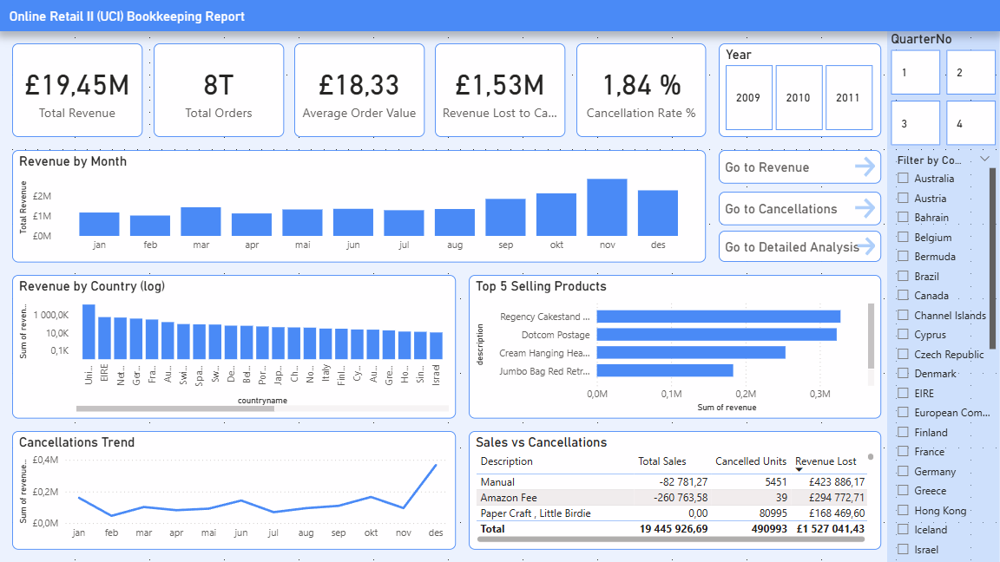
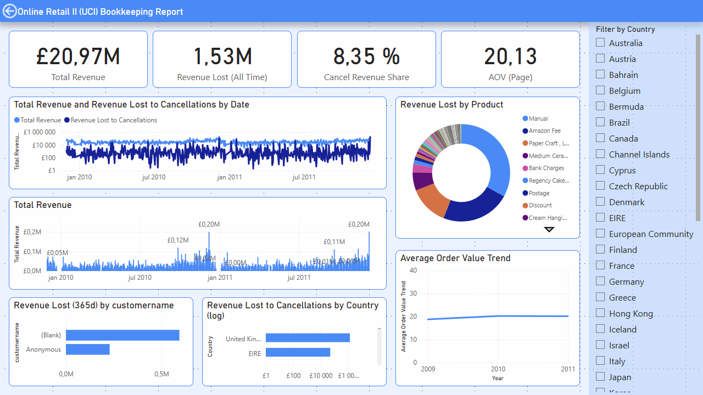
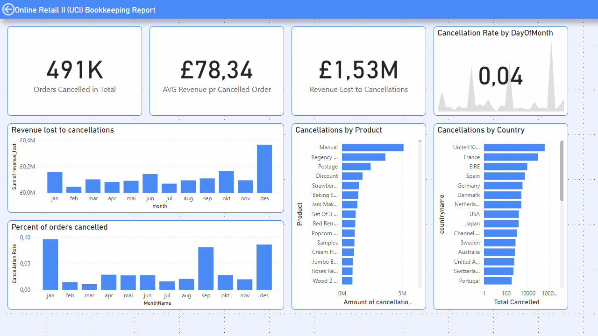
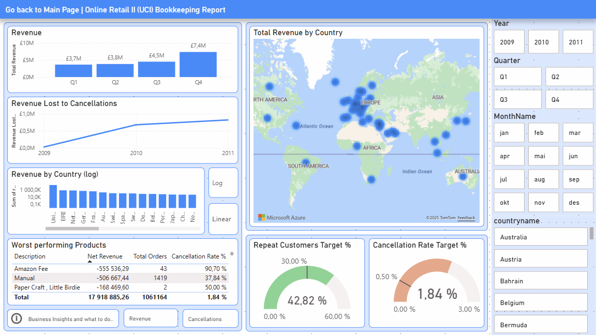
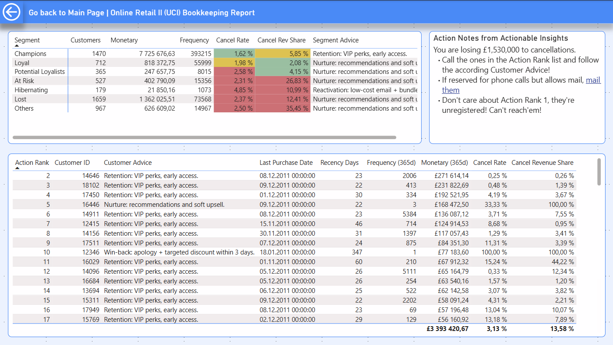

# BID3000 - Business Intelligence Project
## Online Retail Analytics & Customer Segmentation

[](https://www.python.org/)
[](https://www.postgresql.org/)
[](https://powerbi.microsoft.com/)

> **Course:** BID3000 - Business Intelligence  
> **Institution:** University of South-Eastern Norway (USN)  
> **Dataset:** [Online Retail II (UCI Machine Learning Repository)](https://www.kaggle.com/datasets/mashlyn/online-retail-ii-uci)
> **Grade:** A

## 📋 Table of Contents
- [Overview](#overview)
- [Key Features](#key-features)
- [Dashboard Preview](#dashboard-preview)
- [Project Structure](#project-structure)
- [Technologies](#technologies)
- [Installation](#installation)
- [Usage](#usage)
- [Key Findings](#key-findings)
- [Contributors](#contributors)

## 🎯 Overview

This project demonstrates a complete Business Intelligence solution including:
- **Data Warehouse** design using Star Schema
- **ETL Pipeline** with Python and PostgreSQL
- **Predictive Analytics** using Machine Learning (RFM Clustering, CLV Prediction)
- **Interactive Dashboards** in PowerBI
- **Advanced SQL** queries for business insights

The analysis focuses on customer behavior, revenue optimization, and actionable business recommendations based on real e-commerce data.

## ✨ Key Features

### 1. Data Warehouse Design
- **Star Schema** with dimension and fact tables
- **SCD Type 2** implementation for tracking price changes
- Optimized for analytical queries
- Handles 1M+ transactions efficiently

### 2. ETL Process
- Automated data extraction from CSV
- Data quality validation and cleaning
- Dimension table population
- Fact table loading (Sales & Cancellations)
- Comprehensive error handling and logging

### 3. Advanced Analytics

#### Descriptive Analytics
- Revenue analysis by country, product, and time
- Customer segmentation visualization
- Cancellation pattern identification
- Geographic revenue distribution

#### Predictive Analytics
- **RFM Clustering** (Recency, Frequency, Monetary)
  - K-Means clustering with 4 customer segments
  - Elbow method for optimal cluster selection
  - 3D visualization of customer segments
  
- **Customer Lifetime Value (CLV) Prediction**
  - Random Forest Regressor (R² = 0.73)
  - Feature engineering (12 predictive features)
  - RMSE: $5,359 | MAE: $488
  - 84.3% predictions within 20% accuracy

### 4. Business Intelligence Dashboards

PowerBI dashboards with 5 interactive pages:
- **Main Page**: KPIs and overview
- **Revenue Analysis**: Detailed revenue breakdown
- **Cancellations**: Lost revenue analysis
- **Detailed Analysis**: Geographic and temporal insights
- **Customer Segments**: Actionable insights with RFM analysis

## 📸 Dashboard Preview

### Main Dashboard
Overview page with key performance indicators and navigation.



### Revenue Analysis
Detailed revenue breakdown by time, country, and product with drilldown capabilities.



### Cancellations Analysis
Analysis of cancelled orders, lost revenue, and cancellation patterns.



### Detailed Analysis
Geographic distribution and comprehensive business metrics with interactive filters.



### Customer Segmentation
RFM-based customer segments with actionable business insights and recommendations.



## 📁 Project Structure

```
BID3000-project/
│
├── Analytics/
│   ├── BID3000.ipynb                      # Main analysis notebook
│   └── Findings.docx                      # Analysis documentation
│
├── Dashboard/
│   ├── PowerBI.pbix                       # PowerBI dashboard file
│   └── screenshots/                       # Dashboard screenshots
│       ├── PowerBI_dashboard_Main_Page.png
│       ├── PowerBI_dashboard_Revenue.png
│       ├── PowerBI_Dashboard_Cancellations.png
│       ├── PowerBI_dashboard_Detailed_Analysis_Page.png
│       └── PowerBI_Customer_Segments.png
│
├── Database/
│   ├── create_schema.sql                  # Database schema creation
│   ├── queries_bid3000.sql                # 6 advanced SQL queries
│   └── Business_interpretation_of_findings.docx
│
├── Documentation/
│   ├── Data_quality_issues.docx           # Data cleaning documentation
│   ├── ERD_diagram.pdf                    # Entity Relationship Diagram
│   ├── ETL_process_with_key_screenshots.docx
│   ├── warehouse_design_decisions.docx    # Design rationale
│   └── PowerBI_dashboard_Brief_Userguide.md
│
├── ETL/
│   ├── etl.py                             # Main ETL script
│   ├── ETL.docx                           # ETL documentation
│   └── ETL_process_with_key_screenshots.docx
│
├── Report/
│   └── BID3000_Final_Report.docx          # Complete project report
│
├── .gitignore
├── requirements.txt
└── README.md
```

## 🛠 Technologies

**Languages & Frameworks:**
- Python 3.8+
- SQL (PostgreSQL)

**Libraries:**
```
pandas
numpy
scikit-learn
xgboost
matplotlib
psycopg2
```

**Tools:**
- PostgreSQL 13+
- PowerBI Desktop
- Jupyter Notebook
- Git/GitHub

**Machine Learning:**
- K-Means Clustering
- Random Forest Regressor
- Gradient Boosting
- XGBoost

## 🚀 Installation

### Prerequisites
- Python 3.8 or higher
- PostgreSQL 13 or higher
- PowerBI Desktop (for dashboard viewing)

### Setup Steps

1. **Clone the repository**
```bash
git clone https://github.com/Karmaburner/BID3000-Business-Intelligence.git
cd BID3000-Business-Intelligence
```

2. **Install Python dependencies**
```bash
pip install -r requirements.txt
```

3. **Set up PostgreSQL database**
```bash
# Create database
psql -U postgres -c "CREATE DATABASE bid3000_eksamen;"

# Run schema creation script
psql -U postgres -d bid3000_eksamen -f Database/create_schema.sql
```

4. **Configure database credentials**

Edit `ETL/etl.py` with your PostgreSQL credentials:
```python
conn = psycopg2.connect(
    dbname="bid3000_eksamen",
    user="postgres",
    password="your_password",
    host="localhost",
    port=5432
)
```

## 📊 Usage

### 1. Run ETL Process

```bash
# Make sure you have the dataset: online_retail_II.csv
cd ETL
python etl.py
```

**Expected output:**
- Dimension tables populated
- Fact tables loaded (Sales & Cancellations)
- Data quality report
- Execution time: ~2-3 minutes for 1M+ rows

### 2. Run Analytics

Open and run the Jupyter notebook:
```bash
cd Analytics
jupyter notebook BID3000.ipynb
```

### 3. View PowerBI Dashboard

1. Open `Dashboard/PowerBI.pbix` in PowerBI Desktop
2. If prompted, update data source connection to your PostgreSQL instance
3. Refresh data to load from your database

### 4. Execute SQL Queries

```bash
# Run business intelligence queries
psql -U postgres -d bid3000_eksamen -f Database/queries_bid3000.sql
```

## 📈 Key Findings

### Revenue Insights
- **Total Revenue:** £19.45M over 2 years
- **UK Market Dominance:** 92% of revenue (£17.9M)
- **Top Product:** "Regency Cakestand" (£350K revenue)
- **Q4 Revenue Peak:** 38% of annual revenue

### Customer Segmentation (RFM Analysis)
- **Champions** (1,470 customers): £7.7M revenue, 1.62% cancel rate
- **VIP Customers** (Top 50): Generate 25% of total revenue
- **At Risk Customers:** 42% of customers only buy once

### Predictive Model Performance
- **CLV Prediction R²:** 0.73 (73% variance explained)
- **Mean Absolute Error:** $488
- **Predictions within 20%:** 84.3%

### Business Recommendations
1. **Reduce Q1 revenue drop** (20-30% from Q4)
2. **Expand international markets** (only 8% of revenue)
3. **Focus on VIP retention** (£2.1M from 0.8% of customers)
4. **Address high-risk products** (15%+ cancellation rates)
5. **Implement targeted marketing** for "Lost" segment (1,659 customers)

## 👥 Contributors

**Kenneth Andreas Hansen** 

**Jonas El Hbabi Helling** 

**Lucas Leon Svaet Holter** 

**Kristian Martin Tvenning** 

## 📝 License

This project is part of academic coursework at USN and is intended for educational purposes.

## 🙏 Acknowledgments

- **Dataset:** Online Retail II (UCI Machine Learning Repository)
- **Course:** BID3000 - Business Intelligence
- **Institution:** University of South-Eastern Norway (USN)
- **Instructor:** [Course Instructor Name]

## 📧 Contact

For questions or collaboration opportunities:
- **Kenneth Hansen** - [kenneth.andreas.hansen@gmail.com](mailto:kenneth.andreas.hansen@gmail.com)
- **LinkedIn:** [linkedin.com/in/kenneth-hansen-383056b7](https://linkedin.com/in/kenneth-hansen-383056b7)
- **GitHub:** [github.com/Karmaburner](https://github.com/Karmaburner)

---

**⭐ If you find this project helpful, please consider giving it a star!**
